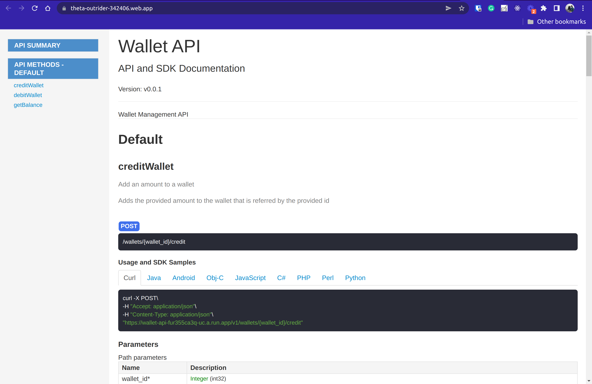

# Wallet API



API For an online wallet management application.

The API documentation is hosted at [https://theta-outrider-342406.web.app][9]

Use the API documentation to learn how to make queries

## Set Up and Run App

### Environment variables configurations

This app uses [viper][14] for configuration management

It follows the principles of [12-factor-app][15]

To run the application make sure you have set the following environment variables

```sh
export WALLET_DB_USER=
export WALLET_DB_PWD=
export WALLET_DB_NAME="wallet"
export WALLET_DB_PORT="3306"
export WALLET_DB_HOST="127.0.0.1"
export WALLET_DB_TIMEZONE="Africa/Nairobi"
export WALLET_DB_INSTANCE_CONNECTION_NAME="theta-outrider-342406:us-central1:wallet"
```

For localhost running the following are already set to defaults

```sh
export WALLET_DB_CLOUD=false
export PORT=8080
```

### Database Set Up

The application uses Mysql. But you can add use a different database by providing a dsn configuration to that database.

To generate the mock data use [Dbeaver][17].

The Mysql database used is a managed service provided by Google Cloud.
Use the Cloud Auth Proxy tool to connect to it from the localhost [Cloud-Auth-Proxy][16]

### Run

Make sure you have go installed. For installation guidance refer to [Golang-installation-page][13]
In the root folder of the application run `go install`. This will compile and install the application to your `$PATH`
Run the application `wallet-api`

## Hosting

### Staging

The api staging endpoint is [https://wallet-api-fur355ca3q-uc.a.run.app][18]

### Production

The api production endpoint is

## References

- OpenAPI Specification (OAS) [OpenAPI-Spec-documentation][2]
- Swagger Editor [Swagger-editor-github][3]
- Link to the Swagger editor hosted online for use [Swagger-editor][8]
- OpenAPI vscode editor [Open-API-marketplace-link][4]
- Swagger Codegen [Swagger-codegen-github]([5]
- Generate Golang server stubs [go-server-github][6]
- Use SDK Manager to install the development tools, used by Swagger tools [sdkman-website][7]
- Mysql Database documentation, for installation, configuration and usage [Mysql-dev-website][10]
- Go Object Relational Mapper(gorm), [gorm-docs][11]
- HTTP status codes [HTTP-Status-Codes-Website][1]

[1]: https://restfulapi.net/http-status-codes
[2]: https://swagger.io/docs/specification/about
[3]: https://github.com/swagger-api/swagger-editor
[4]: https://marketplace.visualstudio.com/items?itemName=42Crunch.vscode-openapi
[5]: https://github.com/swagger-api/swagger-codegen
[6]: https://github.com/swagger-api/swagger-codegen/wiki/Server-stub-generator-HOWTO#go-server
[7]: https://sdkman.io/sdks
[8]: https://editor.swagger.io
[9]: https://theta-outrider-342406.web.app
[10]: https://dev.mysql.com/doc
[11]: https://gorm.io/docs
[12]: https://stackoverflow.com/questions/34046194/how-to-pass-arguments-to-router-handlers-in-golang-using-gin-web-framework
[13]: https://go.dev/doc/install
[14]: https://github.com/spf13/viper
[15]: https://12factor.net
[16]: https://cloud.google.com/sql/docs/mysql/sql-proxy "Cloud SQL Auth Proxy"
[17]: https://dbeaver.io
[18]: https://wallet-api-fur355ca3q-uc.a.run.app/v1/wallets
